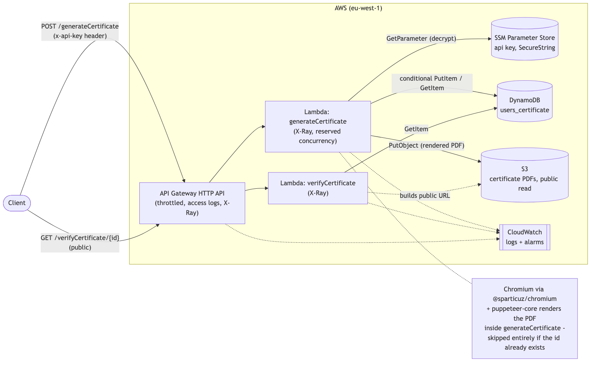
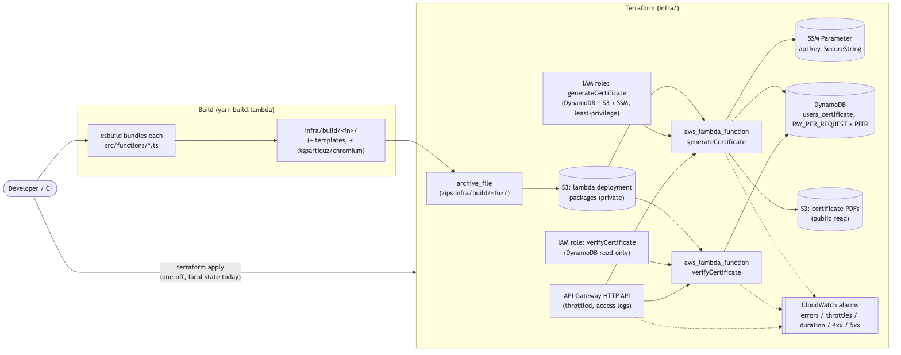

# 📜 Certificate Generation Service

[](https://github.com/luizcurti/nodejs-serverless/actions/workflows/ci.yml)
[](https://nodejs.org)
[](LICENSE)
[](https://www.typescriptlang.org/)

A service that generates and verifies PDF certificates, running on AWS Lambda, DynamoDB, and S3, deployed with Terraform.

## What it does

- **Generate a certificate** (`POST /generateCertificate`): validates the request, stores/reuses a `{id, name, grade}` record in DynamoDB, renders a Handlebars HTML template to a PDF with headless Chromium, and uploads the PDF to S3.
- **Verify a certificate** (`GET /verifyCertificate/{id}`): looks up the record by id and returns its public PDF URL, or `404` if it doesn't exist.

## Architecture



- **API Gateway** (HTTP API) routes the two HTTP endpoints to their Lambda functions, with per-route throttling, structured JSON access logs, and X-Ray tracing.
- **generateCertificate** reads/writes `DynamoDB` and renders the PDF using [`@sparticuz/chromium`](https://github.com/Sparticuz/chromium) + `puppeteer-core` (a Lambda-compatible headless Chromium), then uploads it to `S3`. It runs under its own IAM role and reads its API key from SSM Parameter Store.
- **verifyCertificate** only reads `DynamoDB` and builds the S3 URL from the id — it never touches S3 directly, and runs under a separate, read-only IAM role.
- Both functions have X-Ray tracing enabled and CloudWatch alarms on errors/throttles/duration; the API has alarms on 4xx/5xx (see [Observability](#observability)).


More diagrams (source in [`docs/mmd`](docs/mmd), rendered in [`docs/img`](docs/img)):

| Diagram | |
|---|---|
| [Generate certificate flow](docs/img/generate-certificate-flow.png) | Full request → DynamoDB → Chromium → S3 sequence |
| [Verify certificate flow](docs/img/verify-certificate-flow.png) | Lookup + found/not-found sequence |
| [Deployment architecture](docs/img/deployment-architecture.png) | How `yarn build:lambda` + Terraform turn source into running infrastructure |
| [Local dev stack](docs/img/docker-compose-local-dev.png) | How the Docker Compose services connect |

## Requirements

- Node.js 24.x
- Yarn (the project is developed and locked against Yarn 1 / `yarn.lock`)
- Docker and Docker Compose (for LocalStack-based local dev, integration tests, and Docker validation)
- [Terraform](https://developer.hashicorp.com/terraform) >= 1.6 and an AWS account (only needed to deploy)

## Installation

```bash
yarn install
```

## Environment variables

| Variable | Description | Default |
|---|---|---|
| `IS_OFFLINE` | Set to `true` to use LocalStack (local DynamoDB/S3 endpoints + test credentials) instead of real AWS | — |
| `AWS_REGION` | AWS region used by the SDK clients | `eu-west-1` |
| `S3_BUCKET_NAME` | S3 bucket for storing PDF certificates — required, no built-in default | — |
| `DYNAMODB_TABLE_NAME` | DynamoDB table for certificate records | `users_certificate` |
| `DYNAMODB_ENDPOINT` | DynamoDB endpoint override (local dev) | `http://localhost:4566` |
| `S3_ENDPOINT` | S3 endpoint override (local dev) | `http://localhost:4566` |
| `PORT` | Port for the local dev server (`yarn dev`) | `3000` |
| `API_KEY` | Shared secret required as the `x-api-key` header on `POST /generateCertificate`. Used only when `IS_OFFLINE=true` (local dev/CI) — required in that case, no built-in default | — |
| `API_KEY_PARAMETER_NAME` | SSM parameter name holding the API key. Used instead of `API_KEY` when `IS_OFFLINE` is not set (real AWS); wired automatically by Terraform | — |

See [`.env.example`](.env.example) for a ready-to-copy local `.env`.

## Local development

No account or login of any kind is needed to run this locally — the dev server is a small, dependency-free `http` adapter (`scripts/local-server.ts`), not a hosted framework CLI.

1. **Start LocalStack** (DynamoDB + S3 emulation) and the DynamoDB admin UI:
   ```bash
   yarn docker:up
   ```
2. **Run the API locally** (`API_KEY` is the value `generateCertificate` will require as the `x-api-key` header; use anything for local dev — both it and `S3_BUCKET_NAME` are required, there's no built-in default):
   ```bash
   IS_OFFLINE=true API_KEY=local-dev-api-key S3_BUCKET_NAME=certificadoignite2021 yarn dev
   ```
3. **Try it**:
   ```bash
   curl -X POST http://localhost:3000/generateCertificate \
     -H "Content-Type: application/json" \
     -H "x-api-key: local-dev-api-key" \
     -d '{"id": "test123", "name": "John Doe", "grade": "A+"}'

   curl http://localhost:3000/verifyCertificate/test123
   ```
4. **DynamoDB Admin UI**: `http://localhost:8001`
5. **Stop LocalStack**: `yarn docker:down`

## Docker

`docker-compose.yml` defines three services on one network:

- `localstack` — DynamoDB + S3 (pinned to `4.0.3`; newer LocalStack images require a paid/free account token just to boot, even for these community services)
- `dynamodb-admin` — a UI for the LocalStack DynamoDB table, at `http://localhost:8001`
- `app` — this service, built from the repo's `Dockerfile`, running the same local dev server on port 3000

```bash
yarn docker:up                     # localstack + dynamodb-admin only
docker compose up -d --build app   # add the app container
docker compose logs -f
yarn docker:down
```

The `Dockerfile` uses `node:24-bookworm-slim` (Debian), not `node:24-alpine`: the Chromium binary bundled by `@sparticuz/chromium` is glibc-linked and cannot run on Alpine's musl libc. It also installs the small set of shared libraries (`libnss3`, `libatk-bridge2.0-0`, etc.) that headless Chromium needs at runtime.

The bundled Chromium binary is **x86_64-only** (matching this service's default AWS Lambda architecture). On an Apple Silicon / arm64 machine, build and run the `app` image with `--platform linux/amd64` (Docker will emulate it); GitHub Actions' `ubuntu-latest` runners are x86_64 natively, so CI needs no such flag.

`patches/` is copied into the image *before* `yarn install` runs (not after) — `postinstall` (`patch-package`) needs it present at that point to apply the `.patch` files in `patches/` (fixes for vulnerabilities in transitive dependencies of `newman`/`postman-collection` that don't have a compatible upstream release yet); copying it later would make the patches silently no-op.

## Testing

```bash
yarn test              # unit tests (mocked AWS SDK + Chromium, no external services)
yarn test:coverage     # unit tests with a coverage report
yarn test:integration  # real DynamoDB/S3/Chromium against LocalStack — run `yarn docker:up` first
yarn test:api          # Postman/Newman collection over real HTTP — run `yarn docker:up` first
```

- **Unit tests** (`tests/unit/`) mock DynamoDB, S3, Handlebars, and Chromium/Puppeteer, and cover both handlers' validation, happy-path, and failure branches.
- **Integration tests** (`tests/integration/`) call the handlers directly against a real LocalStack (DynamoDB + S3) and a real headless Chromium render — no mocks. This is also what CI runs against the Dockerized LocalStack.
- **API/collection tests** (`tests/api/`) exercise the same handlers over real HTTP, using the same local server as `yarn dev`, and a Postman collection (`tests/api/certificate.postman_collection.json`) run with [Newman](https://github.com/postmanlabs/newman). It covers unauthorized/success/already-exists/missing-field/invalid-JSON generate scenarios, plus found/not-found verify.

There's no separate "E2E" test tier: for an API this small (two routes), the integration tests (real Chromium + LocalStack, called in-process) and the API/collection tests (the same flows over real HTTP) already cover the full request lifecycle end-to-end without a third, largely-duplicate suite. The Docker Compose app smoke test (see Docker section) is the closest thing to a true black-box E2E check — it exercises the containerized app exactly as a real deployment would receive traffic.

Coverage report: `coverage/lcov-report/index.html` after `yarn test:coverage`.

## Code quality

```bash
yarn format:check   # Prettier
yarn format         # Prettier --write
yarn lint           # ESLint (src/, tests/, scripts/)
yarn lint:fix
npx tsc --noEmit    # typecheck
yarn build          # tsc build, used for typechecking/CI (the deployed bundle is produced separately, see Deployment)
```

## API reference

### `POST /generateCertificate`

Requires an `x-api-key` header matching the deployed `API_KEY` (see [Environment variables](#environment-variables) / [Deployment](#deployment)).

```json
{ "id": "user-unique-id", "name": "John Doe", "grade": "A+" }
```

`id` must match `^[a-zA-Z0-9_-]{1,64}$` (it's used directly as the S3 object key); `name` and `grade` are capped at 100 characters each.

| Status | Body |
|---|---|
| `201 Created` | `{ "message": "Certificate created successfully", "url": "https://<bucket>.s3.amazonaws.com/<id>.pdf" }` |
| `200 OK` | `{ "message": "Certificate already exists", "name": "<stored name>", "url": "https://<bucket>.s3.amazonaws.com/<id>.pdf" }` — returned when `id` already has a record |
| `401 Unauthorized` | `{ "message": "Invalid or missing API key" }` |
| `400 Bad Request` | `{ "message": "Request body is required" }` / `"Invalid JSON in request body"` / `"id, name and grade are required"` / `"id must contain only letters, numbers, \"_\" and \"-\", up to 64 characters"` / `"name and grade must be at most 100 characters"` |
| `500 Internal Server Error` | `{ "message": "Internal server error" }` |

If `id` already exists, the request's `name`/`grade` are ignored (no duplicate DynamoDB write, no PDF re-render/re-upload) and the response reflects the stored record instead — the DynamoDB write uses a `ConditionExpression` so two concurrent requests for the same new `id` can't both "win".

### `GET /verifyCertificate/{id}`

| Status | Body |
|---|---|
| `200 OK` | `{ "message": "Valid certificate", "name": "John Doe", "url": "https://<bucket>.s3.amazonaws.com/<id>.pdf" }` |
| `400 Bad Request` | `{ "message": "Certificate ID is required" }` |
| `404 Not Found` | `{ "message": "Certificate not found" }` |
| `500 Internal Server Error` | `{ "message": "Internal server error" }` |

## Deployment

Infrastructure lives in [`infra/`](infra) (Terraform, AWS provider). Lambda deployment packages are built separately with esbuild (`scripts/build-lambda.js`), since Terraform doesn't bundle application code itself.

```bash
aws configure                # AWS credentials
yarn build:lambda            # bundles both functions into infra/build/
terraform -chdir=infra init  # first time only (or after changing providers)
yarn infra:plan              # build + terraform plan
yarn infra:apply             # build + terraform apply
```

`terraform output` (or the `apply` output) prints the API's base URL, the DynamoDB table name, and the certificate bucket name. The `generateCertificate` API key is generated automatically on first apply and marked sensitive; retrieve it with:

```bash
terraform -chdir=infra output -raw generate_certificate_api_key
```

`yarn infra:destroy` tears everything down.

State is local by default (`infra/terraform.tfstate`, gitignored) — fine for a single developer or small team, and what this repository ships with today (no remote backend is configured). For shared/team use, or to enable the CI `terraform plan`/`apply` jobs described below, add an S3 backend block to `infra/versions.tf`, which needs its own one-time bootstrap **before** `terraform init` will use it:
1. Create an S3 bucket (versioning enabled) to hold `terraform.tfstate`.
2. Create a DynamoDB table (partition key `LockID`, string) for state locking.
3. Add the `backend "s3" { ... }` block to `infra/versions.tf` pointing at that bucket/table, then run `terraform -chdir=infra init -migrate-state`.

`var.certificate_bucket_name` (in `infra/variables.tf`) defaults to `certificadoignite2021`; S3 bucket names are globally unique across all AWS accounts, so you must override it (`terraform apply -var certificate_bucket_name=your-unique-name`).



### CI-driven `terraform plan` / `apply` (optional, disabled by default)

`.github/workflows/ci.yml` includes `terraform-plan` (runs on PRs, posts the plan as a PR comment) and `terraform-apply` (runs on push to `main`) jobs, but both are **no-ops** until you opt in — this project has no remote state and no AWS OIDC role configured out of the box, so there's nothing for them to authenticate with or produce a meaningful diff against. To activate them:
1. Complete the remote backend bootstrap above (a plan against local, always-empty CI state would show "everything will be created" on every run, which isn't a useful diff).
2. Create an IAM role trusted by GitHub's OIDC provider (`token.actions.githubusercontent.com`), scoped to this repo, with permissions to manage the resources in `infra/`.
3. In the repo's GitHub Settings, add secret `AWS_ROLE_ARN` (the role from step 2) and variables `AWS_REGION` and `TF_PLAN_ENABLED=true`.
4. For manual-approval-before-apply, create a `production` GitHub Environment scoped to the `main` branch with required reviewers — `terraform-apply` already targets that environment name.

## CI

`.github/workflows/ci.yml`'s `build-and-test` job runs on every push/PR to `main`: install → dependency audit (production dependencies) → format check → lint → typecheck → unit tests with coverage → build → Lambda packaging + `terraform validate`/`fmt` + `tflint` + `checkov` (all static, no AWS credentials needed) → Docker build → LocalStack (Docker Compose) → integration tests → API/collection tests → full containerized app smoke test → teardown. Two more jobs, `terraform-plan` and `terraform-apply`, exist but are disabled until the one-time setup above is done (see "CI-driven terraform plan / apply").

## Observability

- **Logs**: both Lambdas write structured JSON log lines (`src/utils/logger.ts`) including the API Gateway `requestId`, to their own CloudWatch Log Groups (`infra/lambda.tf`, explicit `retention_in_days`, no default/unmanaged log groups). API Gateway access logs go to a separate log group in JSON format (`infra/apigateway.tf`), independent from each Lambda's own execution logs.
- **Tracing**: both Lambdas have X-Ray active tracing enabled (`tracing_config { mode = "Active" }`), tracing the request across API Gateway → Lambda → DynamoDB/S3/SSM. Note: API Gateway *HTTP APIs* (`aws_apigatewayv2_api`, unlike REST APIs) have no native X-Ray integration at the gateway level — tracing starts from the Lambda side.
- **Alarms** (`infra/observability.tf`): CloudWatch alarms on each Lambda's `Errors`, `Throttles`, and `Duration` (p95 vs. 80% of its timeout), plus the API's `4xx`/`5xx` rates. None have `alarm_actions` wired up yet (no SNS topic/email configured) — they're visible in the CloudWatch console/API today; add an SNS subscription if on-call notification is actually needed.
- **Cost**: an optional AWS Budgets alarm (`aws_budgets_budget.monthly_cost`) is created only when `var.budget_alert_email` is set (`terraform apply -var budget_alert_email=you@example.com`) — a $10/month threshold with an 80% "actual spend" notification, sized for a low-traffic side project rather than production volume.

## Security

- **IAM least-privilege, one role per function**: `generateCertificate` and `verifyCertificate` each have their own IAM role (`infra/lambda.tf`) — `verifyCertificate`'s is DynamoDB `GetItem`-only (it never touches S3), while `generateCertificate`'s adds `PutItem`, S3 `PutObject`/`GetObject` on the certificate bucket only, and SSM `GetParameter`/KMS `Decrypt` scoped to its own parameter.
- **API key on `generateCertificate`, stored outside Lambda env vars**: `POST /generateCertificate` requires an `x-api-key` header matching a random secret Terraform generates and stores in SSM Parameter Store as a `SecureString` (`infra/lambda.tf`) — not a plaintext Lambda environment variable, so it isn't visible to anyone who can read the function's configuration. Compared with `crypto.timingSafeEqual`. `verifyCertificate` stays public/unauthenticated by design, since checking a certificate's validity is meant to be an open operation. Note: a static key like this only makes sense for server-to-server callers — it offers no real protection if ever embedded in a public frontend, since anyone could read it out of the client bundle.
- **`id` is restricted to `^[a-zA-Z0-9_-]{1,64}$`**: it's used directly as the S3 object key, so this rules out path-like values (`/`, `..`) ending up as unexpected keys in the bucket.
- **API Gateway throttling**: the stage applies a tighter rate limit to `POST /generateCertificate` (2 req/s, burst 5) than the rest of the API (10 req/s, burst 20, see `infra/apigateway.tf`), to bound the cost of the Chromium-rendering path even from an authenticated caller gone rogue. `generateCertificate` also has `reserved_concurrent_executions` (`var.generate_certificate_reserved_concurrency`, default 5) as a second layer of cost/blast-radius control.
- **Deployment artifacts are private**: Lambda zip packages are uploaded to a separate, private S3 bucket — never the public certificate bucket.
- **Input validation**: required fields (`id`, `name`, `grade`) are validated before processing; malformed JSON bodies are caught explicitly.
- **No silent duplicate writes**: creating a certificate uses a conditional DynamoDB write (`ConditionExpression: attribute_not_exists(id)`), so two concurrent requests for the same new `id` can't both succeed and overwrite each other.
- **Error handling**: both handlers catch unexpected failures (DynamoDB, S3, Chromium, SSM) and return a `500` with a JSON body instead of letting the exception surface as a generic API Gateway error.
- **Resource cleanup**: the headless browser is always closed via `try/finally`.
- **Backups**: the DynamoDB table has point-in-time recovery enabled (see `infra/dynamodb.tf`) — every issued certificate's record lives only there.
- **Dependency audit**: `yarn audit --groups dependencies` runs in CI against production dependencies.
- **Terraform static analysis**: `tflint` and `checkov` run in CI against `infra/`. Findings that don't fit this project's scale (VPC-for-Lambda, DLQ on synchronously-invoked functions, customer-managed KMS keys everywhere, S3 versioning/replication/access-logging on a bucket that's intentionally public by design, code-signing) are explicitly documented and skipped in `infra/.checkov.yaml`, each with its own justification — not silenced blindly.

## Project structure

```
├── src/
│   ├── functions/             # Lambda handlers
│   ├── templates/             # Handlebars certificate template + stamp image
│   ├── types.ts                # Shared types (e.g. the DynamoDB record shape)
│   └── utils/                 # DynamoDB document client, certificate URL builder, JSON logger
├── scripts/
│   ├── local-server.ts        # Plain HTTP adapter used by `yarn dev` and the API tests
│   ├── bundle-server.js       # esbuild helper shared by run-dev-server.js / run-api-tests.js
│   ├── run-dev-server.js      # `yarn dev`
│   ├── run-api-tests.js       # `yarn test:api`
│   └── build-lambda.js        # `yarn build:lambda` - packages functions for Terraform
├── tests/
│   ├── unit/                  # Mocked unit tests
│   ├── integration/           # Real LocalStack integration tests
│   └── api/                   # Postman/Newman collection
├── infra/                     # Terraform: Lambda, IAM, API Gateway, DynamoDB, S3, observability
│   ├── .tflint.hcl             # tflint config (+ documented rule exception, see CI)
│   └── .checkov.yaml           # checkov skip-check list, each entry justified
├── docs/
│   ├── mmd/                   # Mermaid diagram sources
│   └── img/                   # Rendered diagrams
├── localstack-init/init.sh    # Creates the DynamoDB table + S3 bucket on LocalStack boot
├── docker-compose.yml
├── Dockerfile
└── .github/workflows/ci.yml
```

## Architectural decisions

- **Terraform over Serverless Framework**: Serverless Framework v4 requires an interactive login / license key even for fully local runs (`serverless offline`) — a real friction point for local dev and CI. Terraform has no such requirement; local dev now runs on a plain, dependency-free HTTP adapter instead of a hosted framework CLI.
- **API Gateway HTTP API, not REST API**: simpler and cheaper in Terraform for a plain Lambda-proxy API with no custom authorizers. `payload_format_version = "1.0"` is used so Lambda still receives the classic event shape the handlers are already written against — no handler code changes were needed.
- **Two S3 buckets**: the certificate bucket is intentionally public-read (the API returns direct S3 URLs); Lambda deployment packages go to a separate, private bucket so application source code is never exposed by the same public-read policy.
- **Chromium stack**: `@sparticuz/chromium` + `puppeteer-core`, pinned to versions matching Chromium 143 and Node ≥20.11 to stay compatible with the `nodejs24.x` Lambda runtime.
- **LocalStack pinned to `4.0.3`**: newer images require an auth token to boot at all, even for the free DynamoDB/S3 services this project uses.
- **Debian over Alpine for the Dockerfile**: required for the glibc-linked Chromium binary; see the Docker section above.
- **No framework-level abstractions**: two Lambda handlers, one shared DynamoDB client, no repository/service/DI layers — the domain (validate → read/write one table → optionally render a PDF → upload one object) doesn't warrant them.
- **No VPC, no Dead Letter Queue, no code-signing for the Lambdas**: neither function calls anything VPC-only (DynamoDB/S3/SSM are all public AWS service endpoints, so a VPC would only add NAT cost and cold-start latency); both are invoked *synchronously* by API Gateway, and DLQs only apply to failed *async* invocations; code-signing is a multi-team supply-chain control this single-pipeline project doesn't need. See `infra/.checkov.yaml` for the full, itemized list of static-analysis findings acknowledged this way instead of adding infrastructure nobody would use.
- **AWS-managed KMS keys, not customer-managed CMKs**: SSM's `SecureString` and CloudWatch Logs already encrypt at rest with an AWS-managed key by default; a dedicated customer-managed key adds cost and key-rotation operational overhead not justified for this data (one shared API key value, and application logs with no customer PII beyond a name/grade).

## Troubleshooting

- **LocalStack won't start / exits immediately**: make sure you're on the pinned `localstack/localstack:4.0.3` image (`docker compose down && docker compose up -d`) — the `latest` tag now requires a LocalStack account token.
- **PDF generation fails with a missing shared library** (e.g. `libnspr4.so`): you're running the Chromium binary outside the provided Docker image; install Chromium's runtime dependencies yourself, or run it inside `docker compose`.
- **PDF generation fails with `spawn ENOEXEC` or a Rosetta error**: you're on an arm64 host running the image without `--platform linux/amd64`; add that flag (see Docker section). This also affects `yarn test:integration`/`yarn test:api` run directly on an arm64 host (outside Docker) — run them inside the `app` container instead: `docker compose exec app npx jest --config jest.integration.config.js` (with `DYNAMODB_ENDPOINT`/`S3_ENDPOINT` pointed at `http://localstack:4566`, the in-network hostname).
- **Integration/API tests time out waiting for LocalStack**: run `yarn docker:up` first and confirm `curl http://localhost:4566/_localstack/health` responds.
- **`terraform apply` fails with a bucket name conflict**: S3 bucket names are global; override `certificate_bucket_name` (see Deployment).
